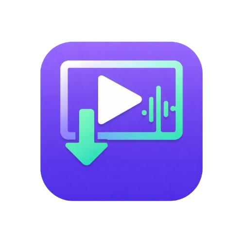

<div align="center">
  
  <h1>VidNestor Web ⚡</h1>
  <p><strong>A high-speed, ad-free, completely private social media downloader.</strong></p>
</div>

---

VidNestor is a powerful open-source web application that allows you to download videos and audio from dozens of social media platforms instantly. Designed with a sleek, modern UI, it prioritizes user privacy, speed, and simplicity.

## ✨ Features

- **No Ads, No Tracking:** 100% private. We don't save your URLs or your downloaded media.
- **Universal Support:** Download from YouTube, Instagram, TikTok, Twitter/X, Pinterest, Facebook, Reddit, Vimeo, and many more.
- **High-Fidelity Audio:** Extract and download high-bitrate MP3 files.
- **Direct Video Downloads:** Save high-definition MP4 videos directly to your device.
- **Playlists Supported:** Expand YouTube playlists and download individual tracks effortlessly.
- **Beautiful UI:** A premium, minimalist interface built with Next.js and pure CSS.

## 🚀 Tech Stack

- **Frontend:** [Next.js](https://nextjs.org/) (React), Vanilla CSS (Custom Design System)
- **Backend:** [FastAPI](https://fastapi.tiangolo.com/) (Python Proxy Engine)
- **Extraction:** [yt-dlp](https://github.com/yt-dlp/yt-dlp)

## 🛠️ Local Development

### 1. Prerequisites
Ensure you have the following installed:
- [Node.js](https://nodejs.org/) (v18+)
- [Python 3.10+](https://www.python.org/)

### 2. Install Dependencies
```bash
# Install frontend dependencies
npm install

# Install Python backend dependencies
pip install -r requirements.txt
```

### 3. Run the Development Server
You only need to run a single command to spin up the full stack (Next.js automatically proxies requests to the Python FastAPI backend):
```bash
npm run dev
```

Open [http://localhost:3000](http://localhost:3000) with your browser to see the app.

## 🤝 Contributing
Contributions are welcome! Please feel free to submit a Pull Request.

## 📝 License
This project is open-source. All rights reserved.
